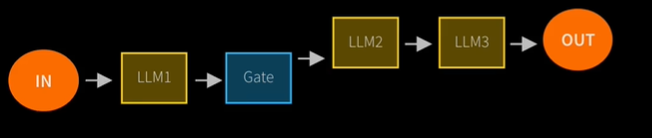
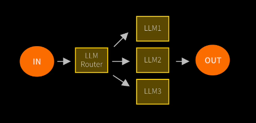
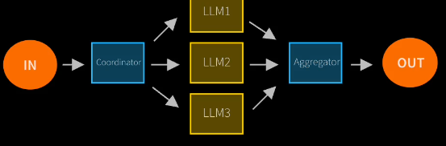
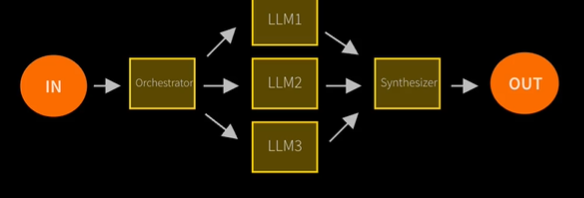
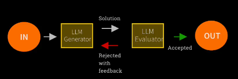
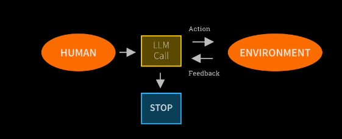
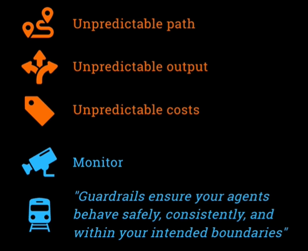
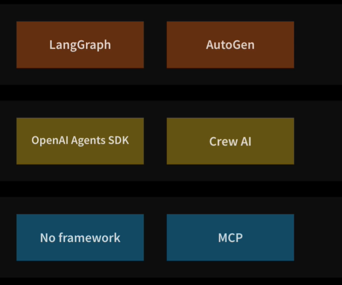
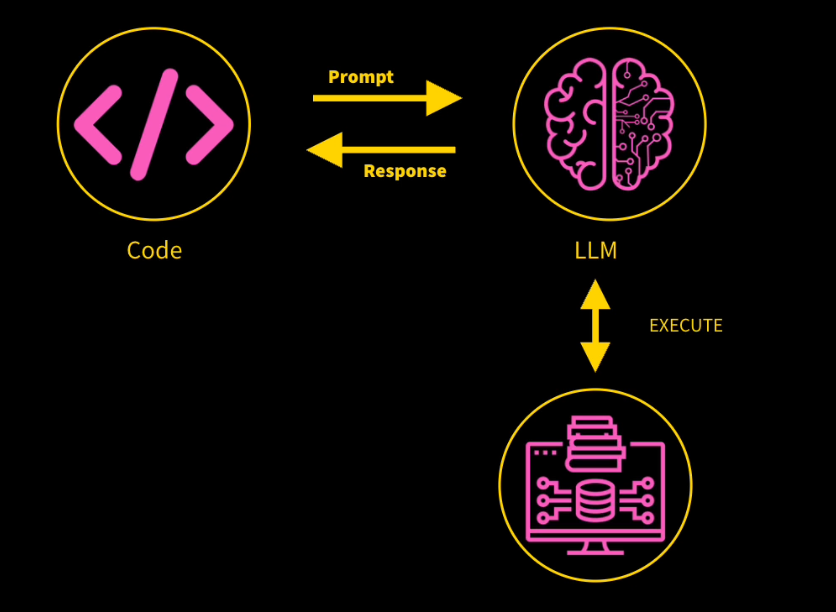
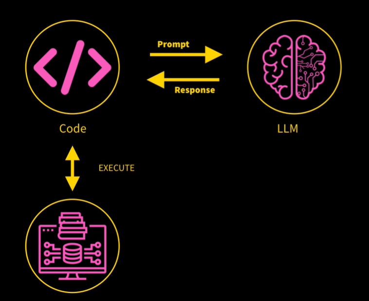

### Agentic AI -> AI Agent are programs where LLM outputs control the workflow

In practice, AI solution involves any or all of these:
1. Multiple LLM calls
2. LLMs with ability to use Tools
3. An environment where LLMs interact
4. A planner to coordinate activites
5. Autonomy

# Agentic System

Anthropic distinguishes two types:
1. Workflow are system where LLMs and tools are orchestrated through predefined code paths
2. Agents are system where LLMs dynamically direct their own processes and tool usage,
maintaining control over how they accomplish tasks

# 5 Workflow design pattern

## 1. Prompt Chaining

Decompose into fixing sub-tasks

## 2. Routing

Direct an input into a specialized the sub-task,
ensuring separation of concerns

Simple is we use LLM to make some decision where to go to solve the case with different LLM and task

## 3. Parallelization

Breaking down taks and running multiple subtask concurrently

The blue one like code or task
so whenever the code we break the task into the LLMs and do the taks. Later the result will combine again to the task or code for final answer. It will run parallel

## 4. Orchestrator-Worker

Complex tasks are broken down dynamically and combined

So basically it's same with the pattern 3
But the diferent is there are no code anymore
so we use LLM to breakdown the task into small part and LLM will do the small task and the result of each LLM will combine and answer again by the final LLM to get the result

## 5. Evaluator-Optimizer

LLM output is validated by another

So, we use LLM to generate something and use another LLM to validate it and give feedback to the LLM and give the new answer based on feedback

# By Contrast, Agents:

### 1. Open-end
### 2. Feedback loops
### 3. No fixed paht

Human will give the request, LLM will able to take action from the environemnt and give feedback to the LLM and LLM stop or not

# Risks of Agent Frameworks

# Agentic AI Frameworks

# Two ways to enhance LLM Capabilities in Agentic AI

## 1. Resource

We can provide an LLM with resources to **improve its expertise**

Basically, this just means **shoving data** relevant to the question into the prompt 

There are techniques like RAG to get really smart at picking **relevant content**

## 2. Tools

Tools are the heart of Agentic AI to give the power to do something

We can give the LLM power to carry out actions like **query database** or **message other LLMs**

Sounds **spooky**, right? OpenAI can reach into my computer?

The reality is a bit **mundane**

### Tool Calling - in Theory

An LLM can reach into my computer

So basically, we ask LLM to do something based on the tools that we have. For example, I have tool to get query my product.
So when I ask about the product the LLM will execute the tool and parse my product to the tool to get the query and give the information again to the LLM for answering the question
