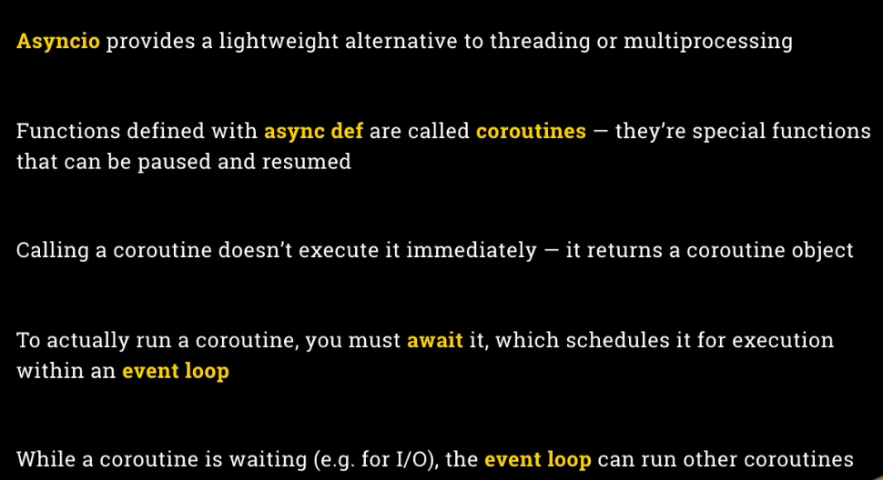

# Aysncio in Python

# Minimal Terminology OpenAI SDK

1. **Agents** represent LLMs
2. **Handoff** represent interaction
3. **Guardrails** represent controls

# Three steps

1. Create an instance of **Agent**
2. Use **with trace()** to track Agent
3. Call **runner.run()** to run the Agent with Async

# Tips for vibe coding

Especiall for number 3, make sure we give the LLM not all but break down into chunk. For example we have 200 lines code error but we can ask LLM like make 4-5 steps and make sure the code can testing indepedently
