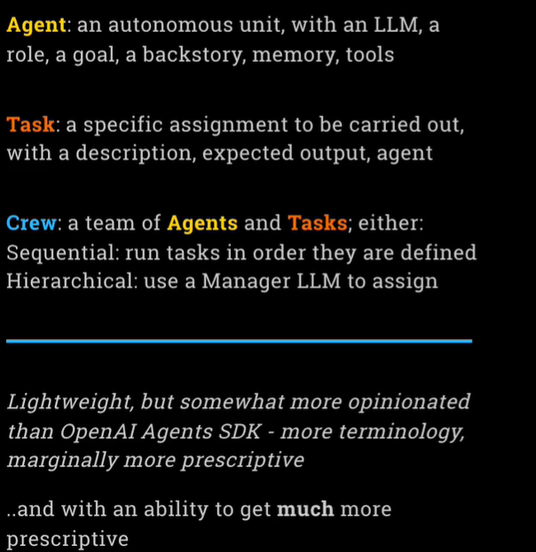
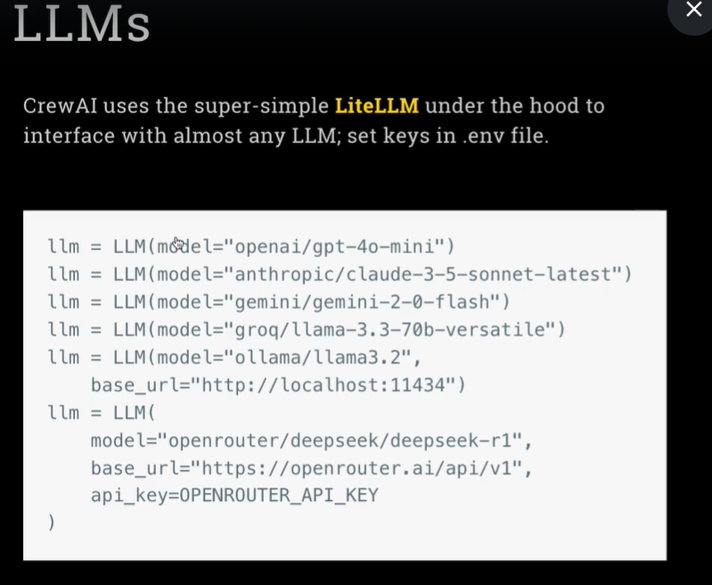
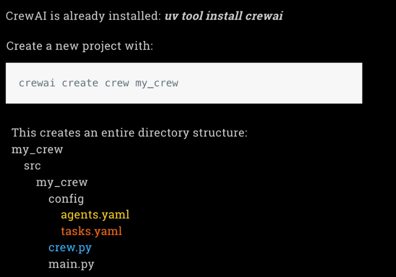

# Crew AI

## Core Concepts

## Memory

### Short-Term
Temporarily stores recent interactions and outcomes using RAG, enabling agents to acces relevant inforamtion during the current executions

## Long-Term Memory
Preserves valuable insight and learning, building knowledge over time

## Entity Memory 
Information about people, places and concepts ecountered during tasks, facilitating deeper understanding and relationship mapping.
Uses RAG for storing entity information

## Contextual Memory
Maintains the context of interactions by combining all the above

## User Memory
Stores user-specific information and preferences, enchancing personalization and user experience (this is up to us to manage and include in prompts)