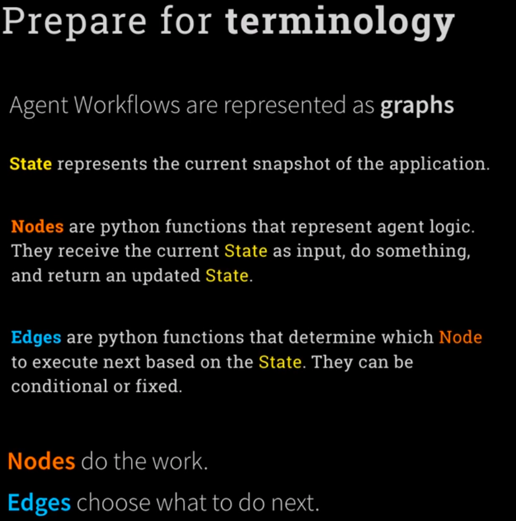
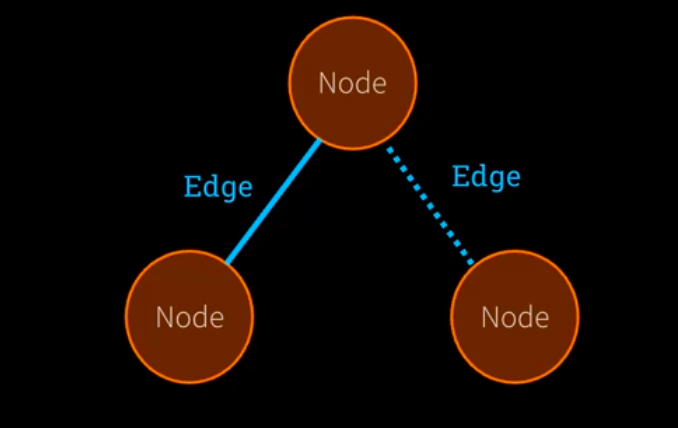
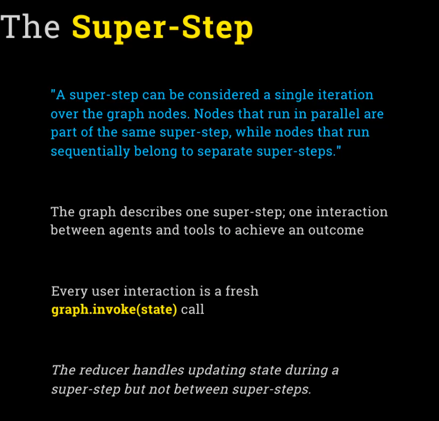
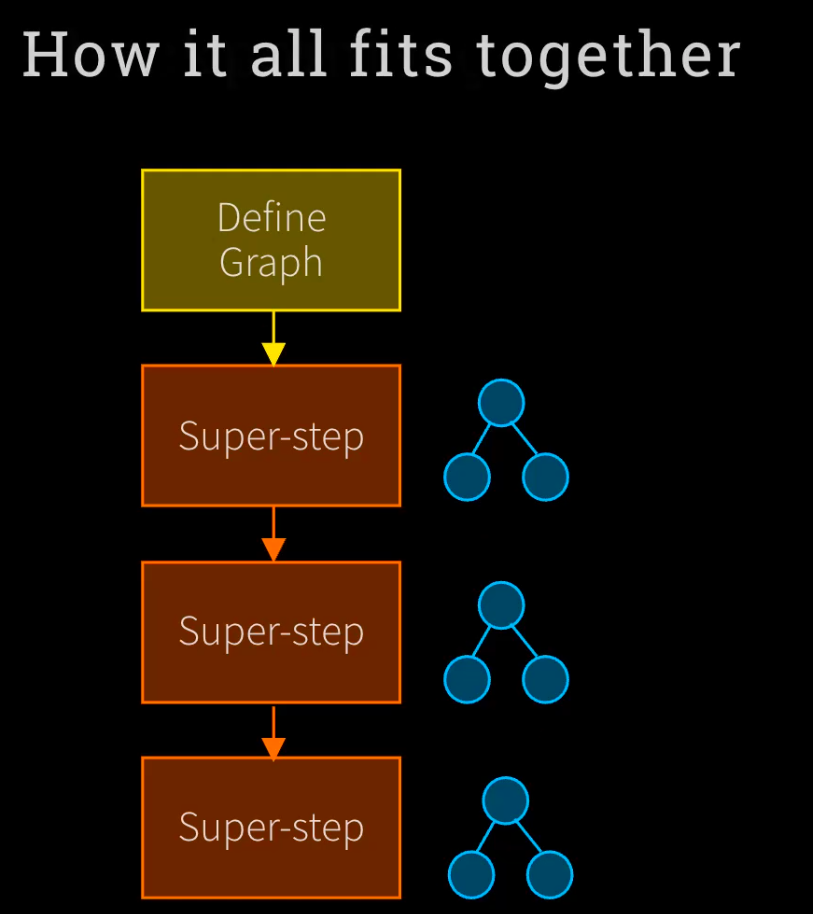

# LangGraph

# Five steps to the first Graph

## 1. Define the State class

## 2. Start the Graph Building

## 3. Create a Node

## 4. Create Edges

## 5. Compile the Graph

State is immutable
For each field in your State, you can specify a special function called a <b>reducer</b>

When you return a new <b> State</b>, LangGraph uses the <b>reducer</b> to combine this field with existing state

This enables LangGraph to run multiple nodes concurrently and combine <b>State</b> without overwritting

 
 

# The Super-Step

# How it all fits together

First we define the graph including nodes and edges
Next use will ask a question or invoke the graph. It called <b>Super-Stap</b>
If you have follow up question it means another Super-Stap
So whatever you call to the grap that is Super-Stap

