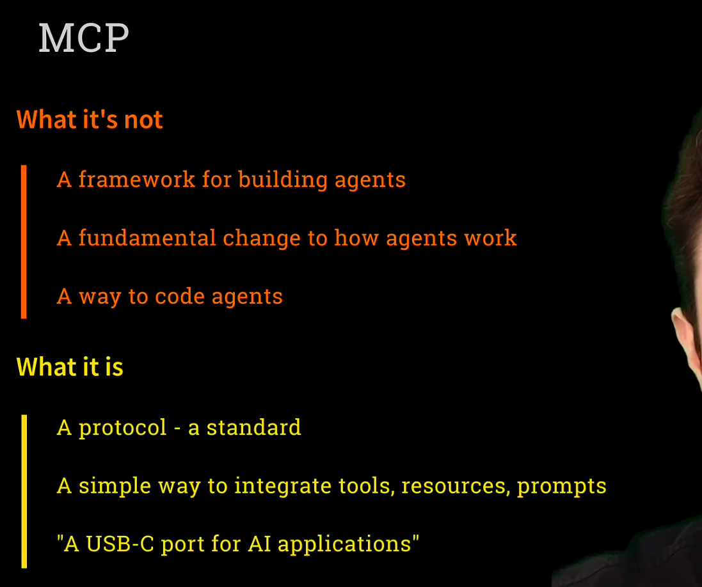
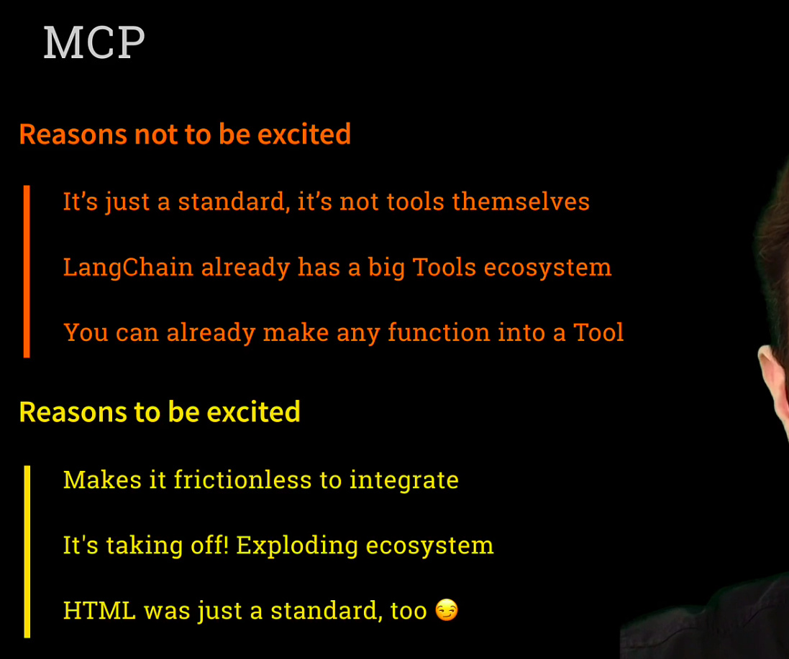
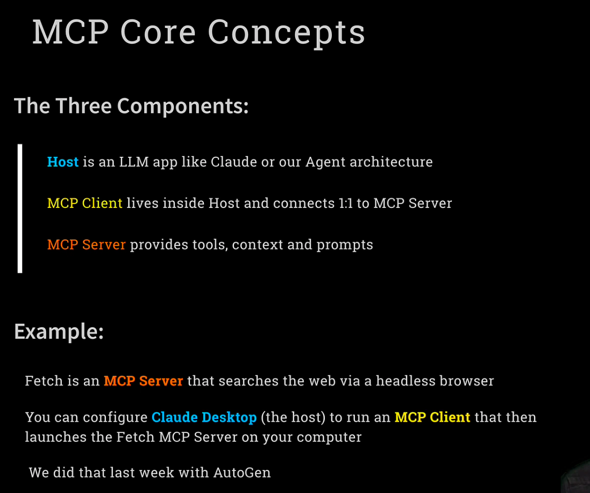
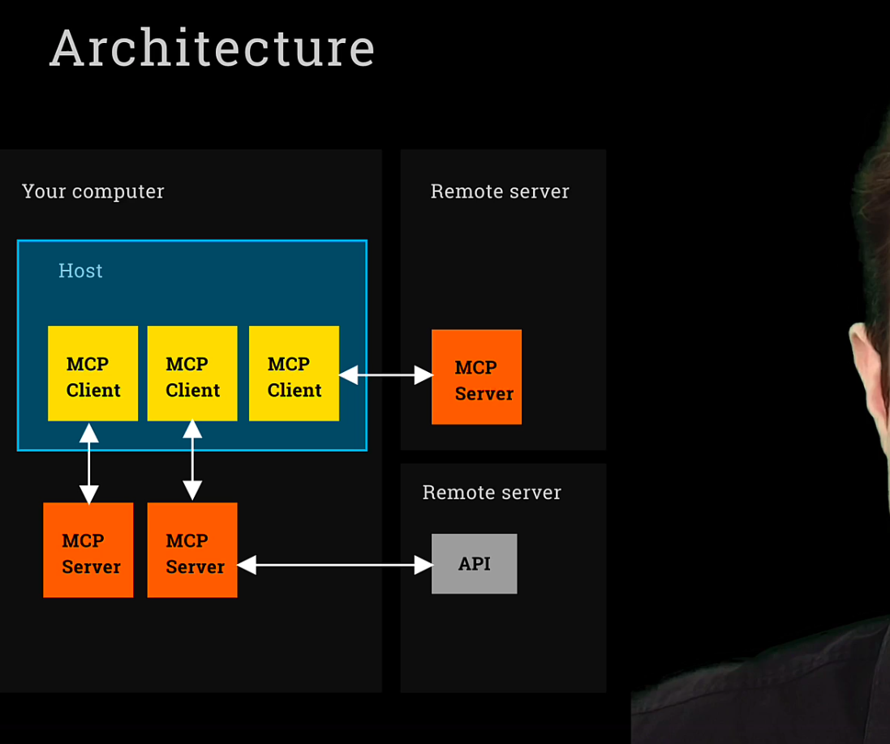
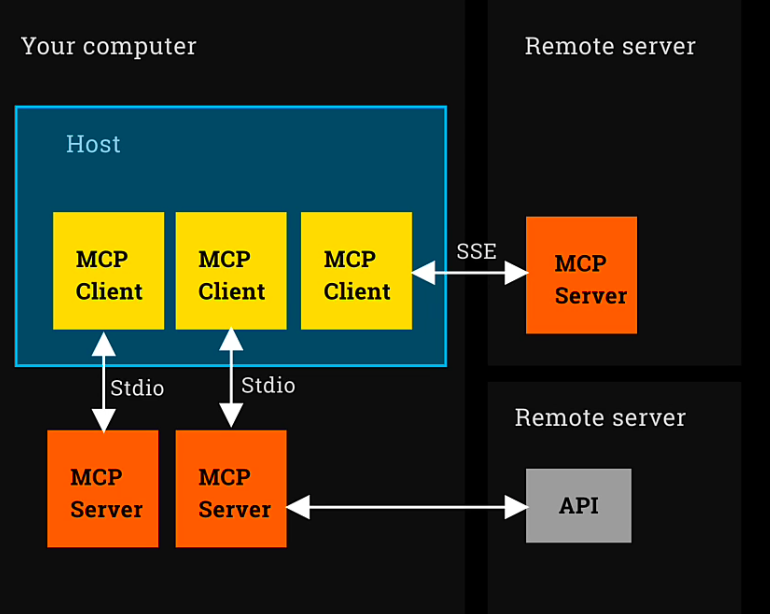
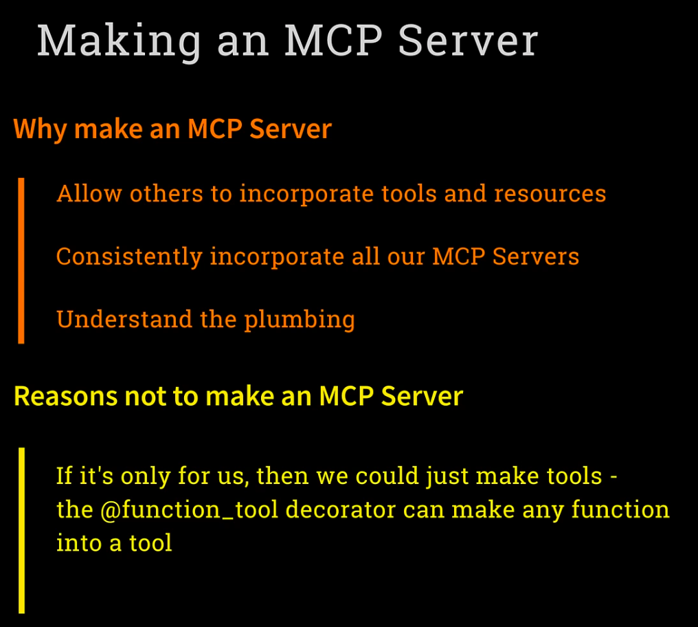
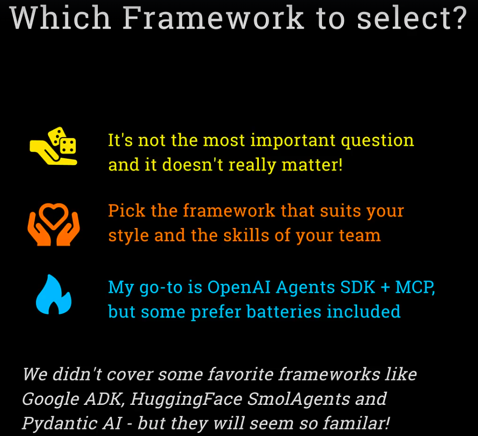
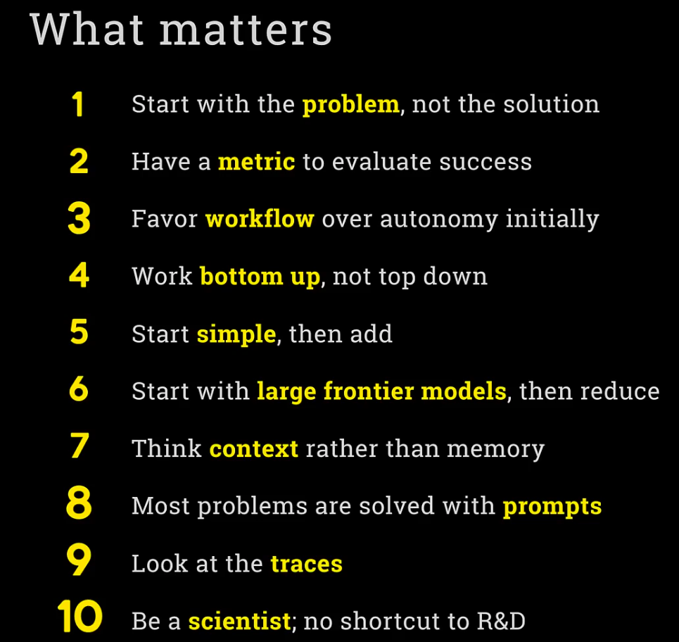
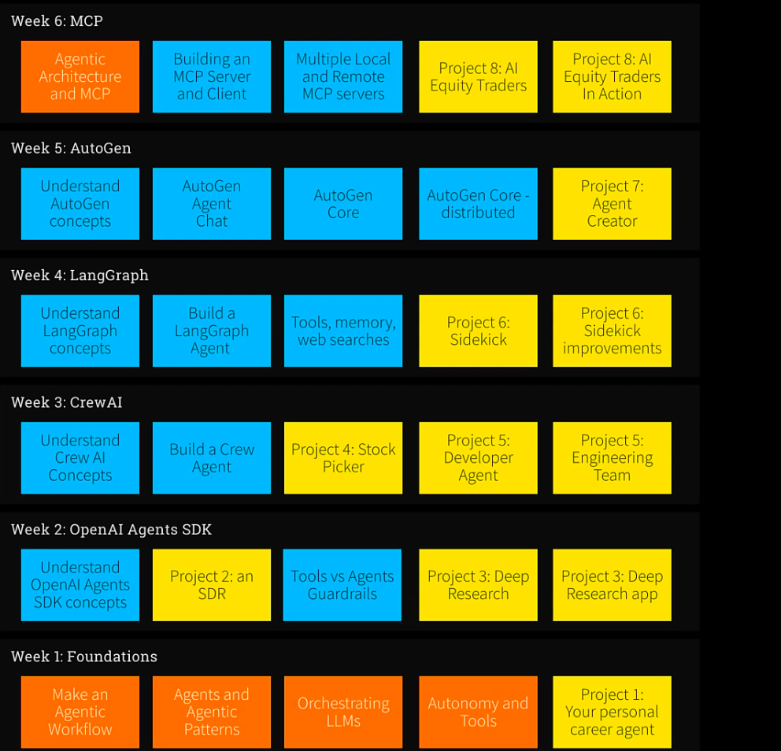

# MCP

# MCP Servers most often run on your box
Download open-source MCP Servers, run them locally

# Two "Transport" Mechanisms

## 1. Sdio (Standard Input/Output) spawns a process and communicates via stdio

## 2. SSE uses HTTPS connection with streaming

# Making an MCP Server

# Which Framework to Select

# What Matters (IMPORTANT)

# JOURNERY

